<html lang="en">
<head>
    <meta charset="UTF-8">
    <meta name="viewport" content="width=device-width, initial-scale=1.0">
    <title>GitHub Profile Header</title>
    <link rel="stylesheet" href="styles.css">
</head>
<body>

    <h1>My GitHub Profile</h1>

    
    

 

    
    

 

</body>
</html>
